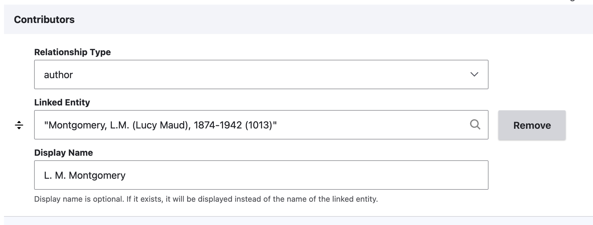

# Typed Relation with Display Name

An extension to the Typed Relation field type that provides an optional display name subfield.

## Requirements

* [Controlled Access Terms](https://www.drupal.org/project/controlled_access_terms/)

## Installation

Install as usual for Drupal modules. 

## Usage

Once installed, a new field type will become available called "Typed Relation with Display Name". It has its own widget and formatter. 

TODO: There is not yet a tool for migrating an existing Typed Relation field into a Typed Relation With Display Name.

TODO: Islandora Workbench compatibility.

## License

[GPLv2](http://www.gnu.org/licenses/gpl-2.0.txt)
